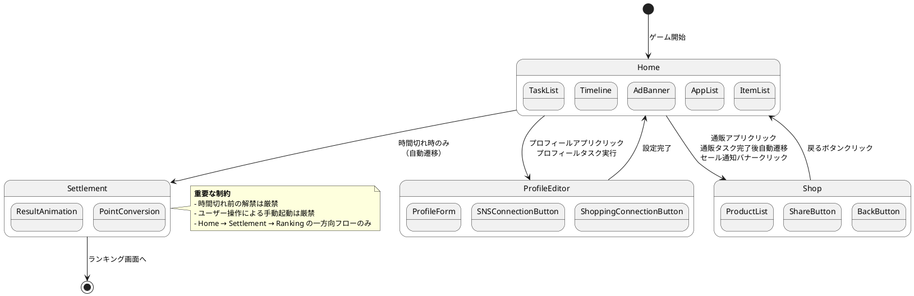
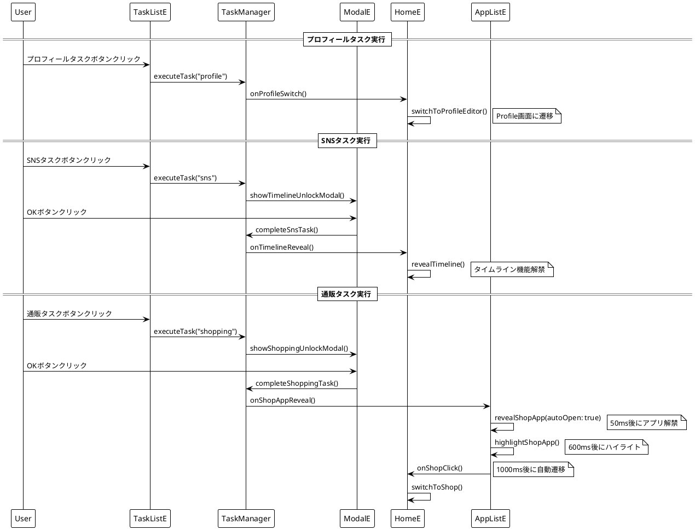
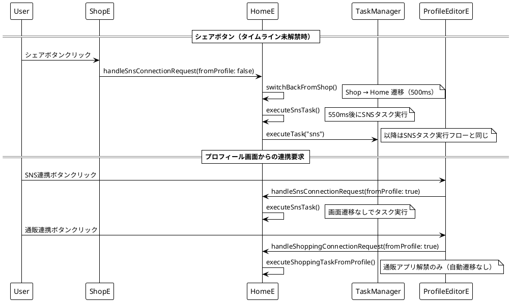
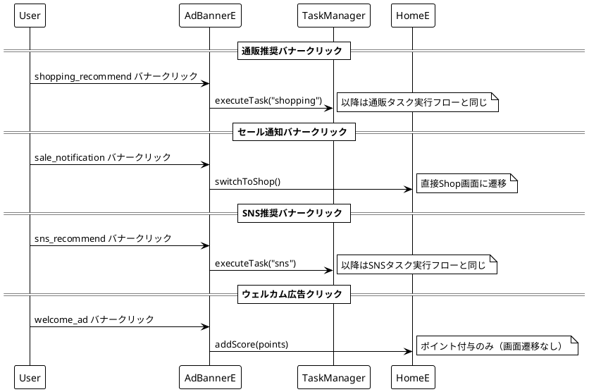
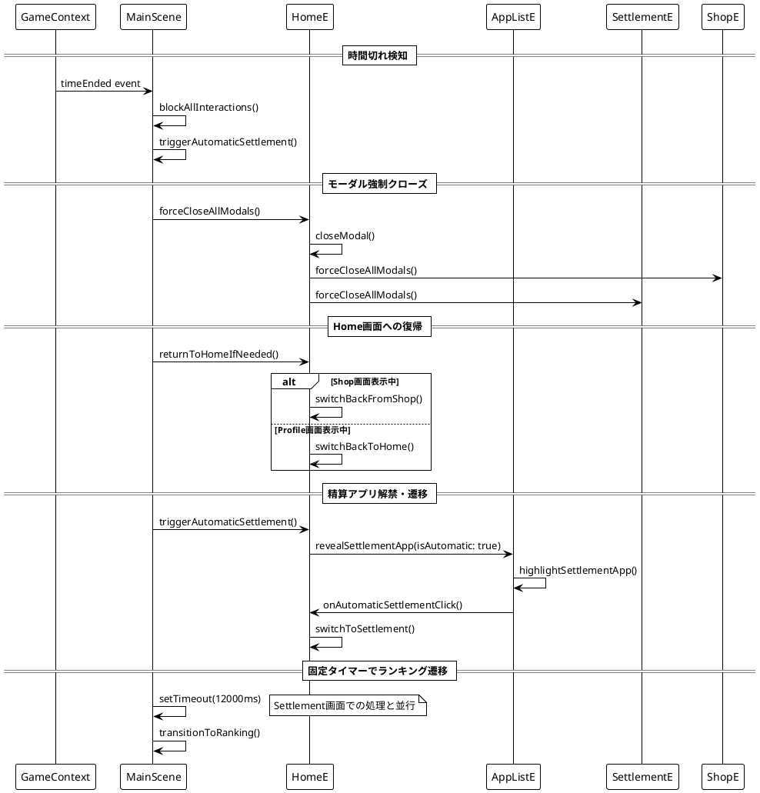

# ユーザー操作による画面遷移・状態変更フロー

## 概要

ポイ活ウォーズにおけるユーザー操作は、大きく以下の4つのカテゴリに分類されます：

1. **直接的な画面遷移操作**: アプリアイコンクリックなど
2. **タスク実行による画面遷移**: タスクボタンクリックによるモーダル表示・機能解禁
3. **特殊な条件付き遷移**: 機能未解禁時の連携要求
4. **バナー広告による遷移**: 広告クリックによる画面遷移・タスク実行

## 画面遷移状態図



## タスク実行フロー図



## 特殊な条件付き遷移フロー



## バナー広告による遷移フロー



## 時間切れ時の自動処理フロー



## ユーザー操作制御が必要な箇所

### 🔒 ロック対象操作一覧

#### 1. 直接的な画面遷移操作
- **プロフィールアプリクリック**: `AppListE.onProfileClick` → `HomeE.switchToProfileEditor()`
- **通販アプリクリック**: `AppListE.onShopClick` → `HomeE.switchToShop()`
- **戻るボタン（Shop）**: `ShopE.backButton` → `HomeE.switchBackFromShop()`
- **戻るボタン（Profile）**: `ProfileEditorE.submitButton` → `HomeE.switchBackToHome()`

#### 2. タスク実行による画面遷移
- **プロフィールタスク**: `TaskListE.executeButton("profile")` → Profile画面遷移
- **SNSタスク**: `TaskListE.executeButton("sns")` → モーダル → タイムライン解禁
- **通販タスク**: `TaskListE.executeButton("shopping")` → モーダル → Shop自動遷移
- **コレクションタスク**: `TaskListE.executeButton("*_collection")` → モーダル表示

#### 3. 特殊な条件付き遷移
- **シェアボタン（未解禁時）**: `ShopE.shareButton` → Shop→Home→SNSタスク実行
- **Profile内SNS連携**: `ProfileEditorE.connectSNSButton` → SNSタスク実行
- **Profile内通販連携**: `ProfileEditorE.connectShoppingButton` → 通販タスク実行

#### 4. バナー広告による遷移
- **通販推奨バナー**: `AdBannerE.shopping_recommend` → 通販タスク実行 → Shop自動遷移
- **セール通知バナー**: `AdBannerE.sale_notification` → Shop画面遷移
- **SNS推奨バナー**: `AdBannerE.sns_recommend` → SNSタスク実行 → タイムライン解禁

### ⚠️ 複数トリガーを持つタスクの課題

**SNSタスク**と**通販タスク**は複数のトリガーポイントを持つため、ロック解除時に実行元を特定する必要があります：

```typescript
// SNSタスクの複数トリガー
1. TaskListE → SNSタスク実行
2. ProfileEditorE → SNS連携  
3. ShopE → シェアボタン（未解禁時）

// 通販タスクの複数トリガー
1. TaskListE → 通販タスク実行
2. ProfileEditorE → 通販連携
3. AdBannerE → 通販推奨バナー
```

**解決策**: defer処理のコールバック関数を引数として渡し、呼び出し元がロック解除の責任を持つ設計に変更する。

### 📋 時間切れ時の処理要件

1. **全操作をロック**
2. **他のロックがすべて解除されるまで待機**（polling ではなく listener による通知）
3. **全モーダルを強制クローズ**（Home, Shop, Settlement のモーダル含む）
4. **現在の画面をHome画面に戻す**（Shop/Profile → Home）
5. **精算アプリ解禁 → Settlement画面遷移**

この仕様により、不測のユーザー操作による画面遷移やアニメーション競合を防ぐことができます。